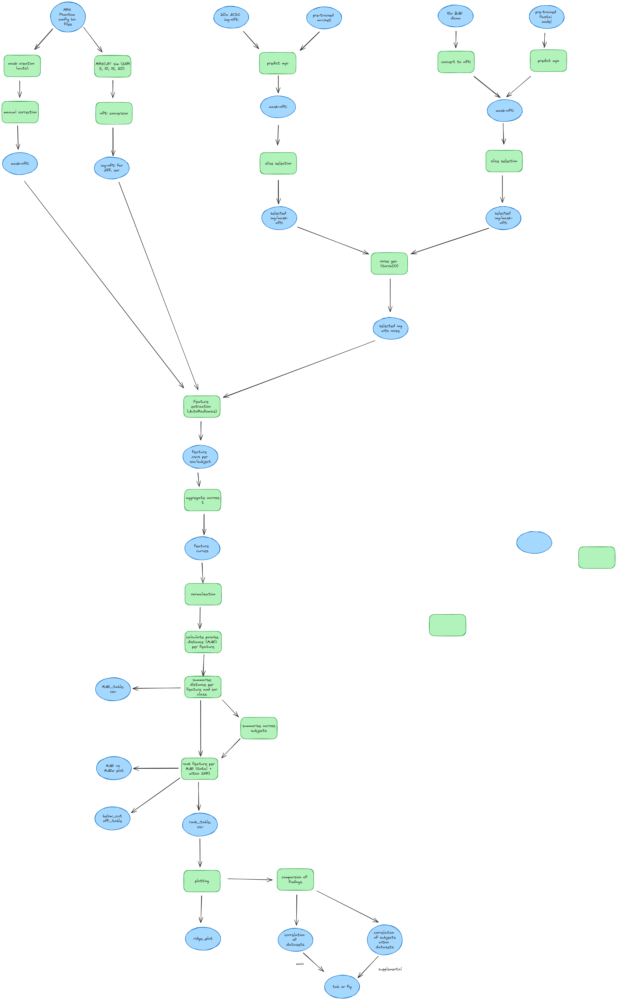

# Stability analysis of dynamic radiomics features for cardiac magnetic resonance

## Introduction

## General workflow

## Data sets

### MRXCAT

Simulations with different SNR (5,10,20,30) using [MRXCAT](https://biomed.ee.ethz.ch/mrxcat.html) [1] version v1.4 and the breathhold phantom.
Code is in [code/mrxcat_simulations](code/mrxcat_simulations) and simulation results in [data/mrxcat_simulations](data/mrxcat_simulations).
The simulations were performed with Matlab version R2021b. Simulation results have to be converted from the cpx format to the nifti format for further analysis. Steps include:
1. .cpx to .csv convertion
2. .csv to .nifti convertion

## References
1. Wissmann, L., Santelli, C., Segars, W.P. et al. MRXCAT: Realistic numerical phantoms for cardiovascular magnetic resonance. J Cardiovasc Magn Reson 16, 63 (2014). https://doi.org/10.1186/s12968-014-0063-3
