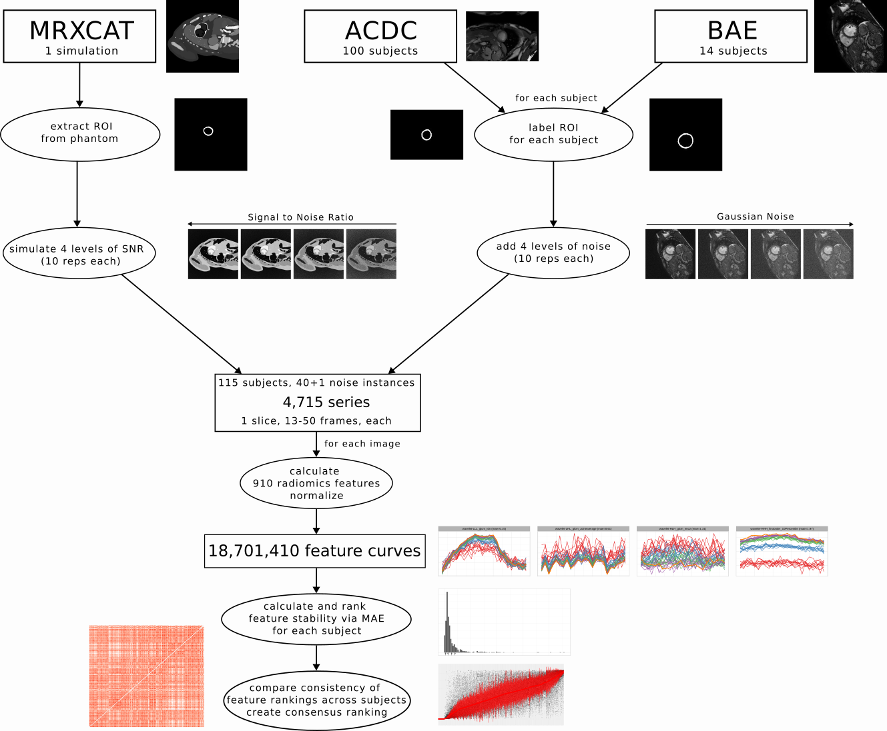

# Stability analysis of dynamic radiomics features for cardiac magnetic resonance

## Introduction

This repository contains the source code for the paper

*Stability of Dynamic Radiomics Features in Cardiac MRI* by Mike D. Klaus, Fabian Laqua, Bettina Baeßler, and Markus J. Ankenbrand. **In preparation**

## General workflow

## Data sets

### MRXCAT

Simulations with different SNR (5,10,20,30) using [MRXCAT](https://biomed.ee.ethz.ch/mrxcat.html) [1] version v1.4 and the breathhold phantom.
Code is in [code/mrxcat_simulations](code/mrxcat_simulations) and simulation results in [data/mrxcat_simulations](data/mrxcat_simulations).
The simulations were performed with Matlab version R2021b. Simulation results have to be converted from the cpx format to the nifti format for further analysis. Steps include:
1. .cpx to .csv convertion
2. .csv to .nifti convertion
The masks were then extracted from the breathhold phantom used for the simulation in MRXCAT.

### ACDC

The ACDC dataset was published as part of the [Automatic Cardiac Detection Challenge](https://www.creatis.insa-lyon.fr/Challenge/acdc/index.html) [2].

### BAE

Data from the publication *A systematic evaluation of three different cardiac T2-mapping sequences at 1.5 and 3T in healthy volunteers* [3].

## References
1. Wissmann, L., Santelli, C., Segars, W.P. et al. MRXCAT: Realistic numerical phantoms for cardiovascular magnetic resonance. J Cardiovasc Magn Reson 16, 63 (2014). https://doi.org/10.1186/s12968-014-0063-3
2. Bernard, O., Lalande, A., Zotti, C., Cervenansky, F., et al. Deep Learning Techniques for Automatic MRI Cardiac Multi-structures Segmentation and Diagnosis: Is the Problem Solved? IEEE Transactions on Medical Imaging, 37, 11, 2514-2525 (2018). https://doi.org/10.1109/TMI.2018.2837502
3. Baeßler, B. et al. A systematic evaluation of three different cardiac T2-mapping sequences at 1.5 and 3T in healthy volunteers. Eur. J. Radiol. 84, 2161–2170 (2015). https://doi.org/10.1016/j.ejrad.2015.08.002